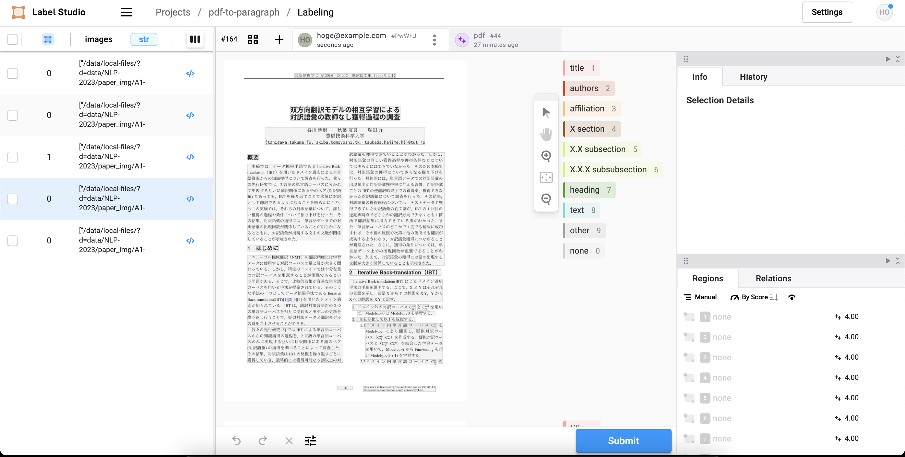
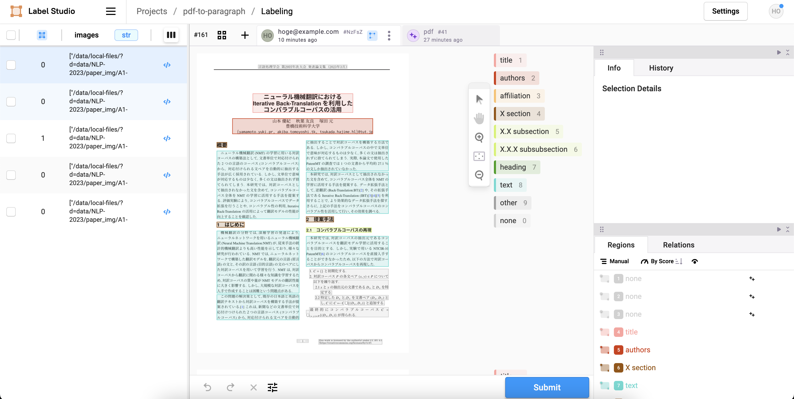

pdf から textbox を取り出して



annotation アプリでラベルを選ぶ



## 手順

### 1. データの準備

論文集を取得する。

```
wget hoge.zip
unzip hoge
remove img/, html/ and index.html in unzipped dir
```

### 2. データ形式の変換

pdf を png に変換する。そして、label studio の task 形式 (json) に変換する。

```
python tools/pdf_to_img.py
python tools/make_task.py
```

TODO: ぎりぎりまで dpi 小さくしたい
TODO: command line arg で呼び出せる幼羽にする

### 3. label studio の構築

まず環境変数を定義する。

```
LABEL_STUDIO_LOCAL_FILES_SERVING_ENABLED=true
LABEL_STUDIO_LOCAL_FILES_DOCUMENT_ROOT=/path/to/repository
```

`LABEL_STUDIO_LOCAL_FILES_DOCUMENT_ROOT` はこのリポジトリの絶対パスを指定する。

できたら起動する。

```
pip install label-studio
label-studio start pdf-to-paragraph --init \
    --username hoge@example.com --password hoge \
    --label-config interface.xml
```

### 4. label studio と local storage を紐付ける

手動で UI を操作する必要がある。

https://labelstud.io/guide/storage#Local-storage

設定項目は以下:

```
path: /path/to/data-dir
filter: .*json
```

## 参考

- hotkey は `interface.xml` で `<Label hotkey="1" value="X section" background="#995200" />` とすれば指定できる。
- task (json) の定義: https://labelstud.io/guide/task_format#Relevant-JSON-property-descriptions
- zoom の挙動が逆 (未解決): https://github.com/HumanSignal/label-studio-frontend/issues/135
- ctrl+click で複数選択できるようでできない (未解決): https://github.com/HumanSignal/label-studio-frontend/issues/604
